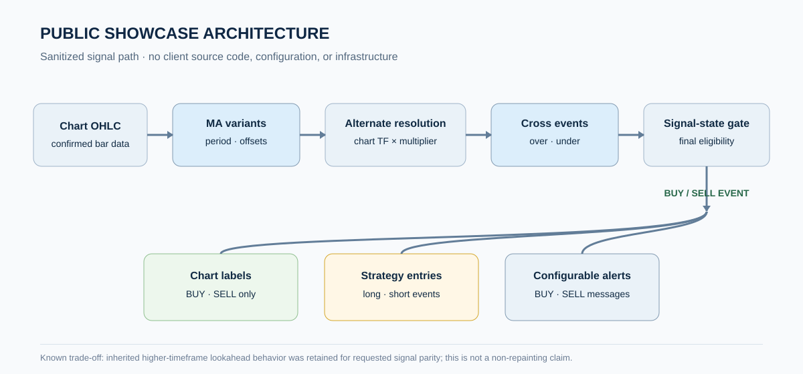
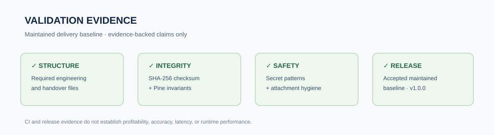

# TradingView Pine Script Signal Engineering Case Study

> **PUBLIC SHOWCASE · SANITIZED · PORTFOLIO-SAFE**
>
> This repository is a public engineering proof artifact. It contains **no client-delivery source code, no client identity, no private infrastructure, no credentials, no production configuration, and no contact information**.



## What this repository is

An anonymized, evidence-first case study for a completed TradingView Pine Script strategy-refactoring engagement. The engineering task was to preserve an established BUY/SELL signal engine while reducing the delivery to its essential trading signals, strategy entries, and configurable alert messages.

The maintained delivery baseline used Pine Script v5, alternate-resolution moving-average series, crossover triggers, an internal signal-state gate, BUY/SELL chart labels, strategy entries, and bar-close alert messages. Supporting repository controls added repeatable validation, checksum verification, disclosure hygiene, and versioned handover evidence.

## Public vs. Private Repository Boundary

| Area | This public showcase | Confidential delivery repository |
|---|---|---|
| Visibility | **Public** | **Private** |
| Purpose | Portfolio, proposals, capability proof | Engineering source of truth |
| Source code | **Not included** | Included |
| Client identity | **Not included** | Protected/confidential |
| Credentials/endpoints | **Not included** | Controlled operational context |
| Production configuration | **Not included** | Controlled operational context |
| Safe to share in a relevant proposal | **Yes** | **No** |

This repository is not a fork, mirror, or source-code export. It was created independently with new, sanitized history.

## Challenge

- Preserve the supplied strategy's established BUY/SELL behavior while removing TP/SL orders, TP/SL visuals, tables, boxes, lines, and other non-signal output.
- Keep the internal state dependencies required by the final entry conditions without exposing those dependencies as user-facing trade-management features.
- Provide customizable BUY and SELL messages suitable for separate chart alerts.
- Document the timing trade-off created by inherited higher-timeframe lookahead behavior without presenting the result as non-repainting.
- Produce a maintainable handover with automated structure, checksum, source-invariant, secret-pattern, and attachment-hygiene checks.

## Architecture

```text
Chart OHLC
  -> configurable moving-average variants
  -> alternate-resolution series
  -> crossover / crossunder triggers
  -> retained internal signal-state gate
  -> final BUY or SELL event
       -> chart label
       -> strategy entry
       -> configurable alert message
```

## Engineering highlights

- **Signal-preserving refactor:** retained the alternate-resolution calculation, moving-average variants, crossover logic, and state gate required by the established signal engine.
- **Lean delivery surface:** limited visible chart output to BUY and SELL labels while removing user-facing TP/SL and unrelated drawing output.
- **Configurable alerts:** exposed independent BUY and SELL message inputs and emitted close-frequency alert calls.
- **Strategy continuity:** kept final signal events connected to Pine strategy entries for chart-level strategy behavior.
- **Explicit timing decision:** documented that the inherited higher-timeframe mapping can change historically after refresh.
- **Reproducible handover:** versioned the maintained baseline, recorded a SHA-256 checksum, and supplied architecture, decision, runbook, security, ownership, and handover documentation.

## Validation evidence



The maintained delivery baseline passed an automated GitHub Actions validation job covering:

1. required repository and handover files;
2. the delivered Pine file checksum;
3. expected Pine source invariants for labels, messages, alerts, and retained signal behavior;
4. absence of disallowed TP/SL order or non-signal drawing constructs;
5. likely credential patterns and excluded client-attachment types.

The completed delivery baseline was accepted and versioned as **v1.0.0**.

> CI proves repository, integrity, and source-invariant checks. TradingView compilation and chart-by-chart behavioral comparison remain platform-side validation activities and are not claimed as independently regenerated by this public showcase.

## Technology stack

`Pine Script v5` · `TradingView` · `Multi-timeframe series` · `Strategy alerts` · `Bash` · `YAML` · `SHA-256` · `GitHub Actions`

## Outcome / what this demonstrates

The engagement produced a lightweight, documented strategy baseline focused on BUY/SELL signals and configurable alerts while preserving a requested legacy timing behavior. It demonstrates capability in Pine Script analysis, signal-engine refactoring, strategy/alert integration, multi-timeframe behavior, trade-off documentation, CI-backed delivery, and confidentiality-safe handover.

## What is intentionally not claimed

This showcase does **not** claim:

- non-repainting behavior;
- profitability, win rate, signal accuracy, ROI, savings, or performance percentages;
- verified latency or execution-speed benchmarks;
- broker execution, webhook receiver infrastructure, or production automation outside TradingView;
- identical behavior across every symbol, broker feed, chart type, timeframe, or configuration;
- an independently regenerated runtime screenshot.

No runtime screenshot is included because a safe TradingView runtime was not available in the current environment for independent regeneration. No screenshot has been fabricated.

## Full case study

[**Read the full public case study**](case-study.md) · [**Download the concise PDF**](case-study.pdf)

Additional public-safe technical detail is available in:

- [Technical overview](docs/technical-overview.md)
- [Validation evidence](docs/validation-evidence.md)
- [Disclosure boundary](docs/disclosure-boundary.md)

## Disclosure boundary

This repository intentionally omits client identity, personal details, contact information, private repository URLs, credentials, production endpoints, internal infrastructure, contract/payment information, private conversations, confidential screenshots, production configurations, and client-delivery source code.

This is a **sanitized public showcase**, not the engineering source of truth.
